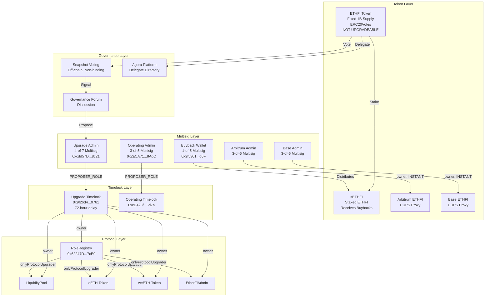
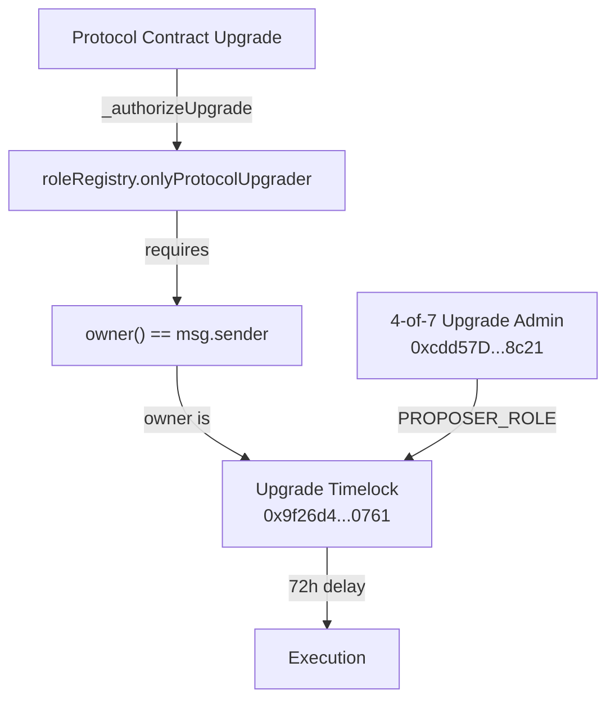
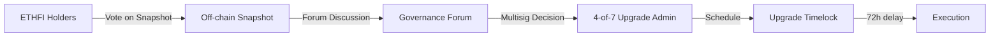

# ETHFI Token Research Report

## Aragon Ownership Token Framework Analysis

**Target:** ETHFI (Ether.fi Governance Token)
**Token Address:** [`0xFe0c30065B384F05761f15d0CC899D4F9F9Cc0eB`](https://etherscan.io/address/0xFe0c30065B384F05761f15d0CC899D4F9F9Cc0eB) (Ethereum Mainnet)
**Date:** 2026-02-24
**Researcher:** Aragon OTF Agent

---

## Executive Summary

ETHFI is a governance token for the ether.fi liquid staking protocol. The token implements ERC20Votes for on-chain voting capability, but **governance is currently in a transitional phase** with votes occurring off-chain via Snapshot, executed by a team-controlled multisig.

**Critical Correction:** Previous research incorrectly identified the upgrade authority. After tracing the full ownership chain from the deployed contracts, protocol upgrades are **timelocked with a 72-hour delay**, not instant.

**Key Findings:**
- **Supply:** Fixed at 1B with ~998.5M currently circulating (some burned). No mint function exists.
- **Governance:** Off-chain Snapshot voting → multisig execution. Not on-chain binding.
- **Upgrade Authority:** 4-of-7 multisig → 72-hour Timelock → RoleRegistry → Protocol contracts. Upgrades require a 72-hour delay.
- **Value Accrual:** Active buyback program distributing to sETHFI stakers, but Foundation-discretionary via 1-of-5 wallet.
- **Token Rights:** No censorship, no pause, no blacklist in ETHFI token contract.
- **L2 Tokens:** Upgradeable on Arbitrum and Base, controlled by 3-of-6 multisigs (no timelock).

---

## Governance and Ownership Model

### Contract Architecture

| Contract | Address | Type | Upgradeable |
|----------|---------|------|-------------|
| ETHFI Token | [`0xFe0c30065B384F05761f15d0CC899D4F9F9Cc0eB`](https://etherscan.io/address/0xFe0c30065B384F05761f15d0CC899D4F9F9Cc0eB) | ERC20 | No |
| RoleRegistry | [`0x62247D29B4B9BECf4BB73E0c722cf6445cfC7cE9`](https://etherscan.io/address/0x62247D29B4B9BECf4BB73E0c722cf6445cfC7cE9) | Access Control | Yes (UUPS) |
| LiquidityPool | [`0x308861A430be4cce5502d0A12724771Fc6DaF216`](https://etherscan.io/address/0x308861A430be4cce5502d0A12724771Fc6DaF216) | Core Protocol | Yes (UUPS) |
| eETH | [`0x35fA164735182de50811E8e2E824cFb9B6118ac2`](https://etherscan.io/address/0x35fA164735182de50811E8e2E824cFb9B6118ac2) | Rebasing Token | Yes (UUPS) |
| weETH | [`0xCd5fE23C85820F7B72D0926FC9b05b43E359b7ee`](https://etherscan.io/address/0xCd5fE23C85820F7B72D0926FC9b05b43E359b7ee) | Wrapped Token | Yes (UUPS) |
| EtherFiAdmin | [`0x0EF8fa4760Db8f5Cd4d993f3e3416f30f942D705`](https://etherscan.io/address/0x0EF8fa4760Db8f5Cd4d993f3e3416f30f942D705) | Admin | Yes (UUPS) |
| Treasury | [`0x0c83EAe1FE72c390A02E426572854931EefF93BA`](https://etherscan.io/address/0x0c83EAe1FE72c390A02E426572854931EefF93BA) | Protocol Treasury | [VERIFY] |
| Upgrade Timelock | [`0x9f26d4C958fD811A1F59B01B86Be7dFFc9d20761`](https://etherscan.io/address/0x9f26d4C958fD811A1F59B01B86Be7dFFc9d20761) | TimelockController | No |
| Operating Timelock | [`0xcD425f44758a08BaAB3C4908f3e3dE5776e45d7a`](https://etherscan.io/address/0xcD425f44758a08BaAB3C4908f3e3dE5776e45d7a) | TimelockController | No |
| sETHFI | [`0x86B5780b606940Eb59A062aA85a07959518c0161`](https://etherscan.io/address/0x86B5780b606940Eb59A062aA85a07959518c0161) | Staking | [VERIFY] |

### L2 Token Contracts

| Network | Address | Type | Owner |
|---------|---------|------|-------|
| Arbitrum | [`0x7189fb5B6504bbfF6a852B13B7B82a3c118fDc27`](https://arbiscan.io/address/0x7189fb5B6504bbfF6a852B13B7B82a3c118fDc27) | UUPS Proxy | 3-of-6 Multisig (`0x0c6ca434756eedf928a55ebeaf0019364b279732`) |
| Base | [`0x6C240DDA6b5c336DF09A4D011139beAAa1eA2Aa2`](https://basescan.org/address/0x6C240DDA6b5c336DF09A4D011139beAAa1eA2Aa2) | UUPS Proxy | 3-of-6 Multisig (`0x7a00657a45420044bc526b90ad667affaee0a868`) |

### Privileged Role Matrix

| Contract | Role | Current Holder | Holder Type | Verification | Controller |
|----------|------|----------------|-------------|--------------|------------|
| RoleRegistry | owner | `0x9f26d4C958fD811A1F59B01B86Be7dFFc9d20761` | Timelock | `eth_call owner() = 0x9f26d4c958fd811a1f59b01b86be7dffc9d20761` | 4-of-7 Upgrade Admin |
| LiquidityPool | owner | `0x9f26d4C958fD811A1F59B01B86Be7dFFc9d20761` | Timelock | `eth_call owner() = 0x9f26d4c958fd811a1f59b01b86be7dffc9d20761` | 4-of-7 Upgrade Admin |
| eETH | owner | `0x9f26d4C958fD811A1F59B01B86Be7dFFc9d20761` | Timelock | `eth_call owner() = 0x9f26d4c958fd811a1f59b01b86be7dffc9d20761` | 4-of-7 Upgrade Admin |
| weETH | owner | `0x9f26d4C958fD811A1F59B01B86Be7dFFc9d20761` | Timelock | `eth_call owner() = 0x9f26d4c958fd811a1f59b01b86be7dffc9d20761` | 4-of-7 Upgrade Admin |
| EtherFiAdmin | owner | `0x9f26d4C958fD811A1F59B01B86Be7dFFc9d20761` | Timelock | `eth_call owner() = 0x9f26d4c958fd811a1f59b01b86be7dffc9d20761` | 4-of-7 Upgrade Admin |
| Upgrade Timelock | PROPOSER_ROLE | `0xcdd57D11476c22d265722F68390b036f3DA48c21` | 4-of-7 Multisig | `hasRole(PROPOSER_ROLE, addr) = true` | Team-controlled |
| Upgrade Timelock | EXECUTOR_ROLE | `0xcdd57D11476c22d265722F68390b036f3DA48c21` | 4-of-7 Multisig | `hasRole(EXECUTOR_ROLE, addr) = true` | Team-controlled |
| Upgrade Timelock | CANCELLER_ROLE | `0xcdd57D11476c22d265722F68390b036f3DA48c21` | 4-of-7 Multisig | `hasRole(CANCELLER_ROLE, addr) = true` | Team-controlled |
| Arbitrum ETHFI | owner | `0x0c6ca434756eedf928a55ebeaf0019364b279732` | 3-of-6 Multisig | `eth_call owner()` | Team-controlled |
| Base ETHFI | owner | `0x7a00657a45420044bc526b90ad667affaee0a868` | 3-of-6 Multisig | `eth_call owner()` | Team-controlled |

### Multisig Details

| Multisig | Address | Threshold | Purpose |
|----------|---------|-----------|---------|
| Upgrade Admin | [`0xcdd57D11476c22d265722F68390b036f3DA48c21`](https://etherscan.io/address/0xcdd57D11476c22d265722F68390b036f3DA48c21) | 4-of-7 | Timelock PROPOSER/EXECUTOR for protocol upgrades |
| Operating Admin | [`0x2aCA71020De61bb532008049e1Bd41E451AE8AdC`](https://etherscan.io/address/0x2aCA71020De61bb532008049e1Bd41E451AE8AdC) | 3-of-5 | Operating Timelock proposer |
| Buyback/Foundation | [`0x2f5301a3D59388c509C65f8698f521377D41Fd0F`](https://etherscan.io/address/0x2f5301a3D59388c509C65f8698f521377D41Fd0F) | 1-of-5 | ETHFI buybacks and distribution |
| Arbitrum L2 Admin | [`0x0c6ca434756eedf928a55ebeaf0019364b279732`](https://arbiscan.io/address/0x0c6ca434756eedf928a55ebeaf0019364b279732) | 3-of-6 | Arbitrum ETHFI token upgrades |
| Base L2 Admin | [`0x7a00657a45420044bc526b90ad667affaee0a868`](https://basescan.org/address/0x7a00657a45420044bc526b90ad667affaee0a868) | 3-of-6 | Base ETHFI token upgrades |

**Upgrade Admin Signers (4-of-7):**
1. `0x9506429a421757711806c5caf25ba1830e349b09`
2. `0x4507cfb4b077d5dbddd520c701e30173d5b59fad`
3. `0x5c8c76f2e990f194462dc5f8a8c76ba16966ed42`
4. `0x0fce5cd3fb6f3b3fb7f0f707070a0a7e2442f444`
5. `0x648aa14e4424e0825a5ce739c8c68610e143fb79`
6. `0x2f2806e8b288428f23707a69faa60f52bc565c17`
7. `0x173286fafabea063eeb3726ee5efd4ff414057b9`

### Ownership Topology Diagram



### Upgrade Authority Path (Corrected)

The previous research incorrectly stated upgrades bypass the timelock. The correct upgrade path is:



**Code Evidence (RoleRegistry.sol lines 76-78):**
```solidity
function onlyProtocolUpgrader(address account) public view {
    if (owner() != account) revert OnlyProtocolUpgrader();
}
```
- Source: [RoleRegistry.sol:76-78](https://github.com/etherfi-protocol/smart-contracts/blob/master/src/RoleRegistry.sol#L76-L78)

**On-chain Verification:**
```
RoleRegistry.owner() = 0x9f26d4c958fd811a1f59b01b86be7dffc9d20761 (Upgrade Timelock)
Timelock.getMinDelay() = 259200 (72 hours)
Timelock.hasRole(PROPOSER_ROLE, 0xcdd57D11476c22d265722F68390b036f3DA48c21) = true
```

**Conclusion:** Protocol upgrades (LiquidityPool, eETH, weETH, EtherFiAdmin, RoleRegistry) REQUIRE:
1. 4-of-7 multisig proposal
2. 72-hour timelock delay
3. Execution by the same multisig

---

## 1. On-Chain Control

### 1.1 Onchain Governance Workflow

**Status:** ⚠️ PARTIAL

**Finding:** ETHFI implements ERC20Votes enabling delegation and voting power tracking. However, the protocol does **not** currently have a deployed on-chain Governor contract that binds token votes to protocol execution.

**Current Flow:**


**Evidence:**
- Agora governance page states Phase 1 includes: "launching offchain voting on Snapshot, delegate elections, our security council, and discourse groups"
  - Source: [Agora Governance Info](https://vote.ether.fi/info)
- Agora platform (vote.ether.fi) is a delegate directory, not binding on-chain voting
- 4-day voting window with 1M ETHFI quorum required
  - Source: [Governance Forum](https://governance.ether.fi/)

**Implication:** ETHFI tokenholders can signal preference but cannot unilaterally force execution. The multisig committee can theoretically ignore Snapshot results.

---

### 1.2 Role Accountability

**Status:** ⚠️ PARTIAL

**Finding:** Protocol roles are managed via RoleRegistry at `0x62247D29B4B9BECf4BB73E0c722cf6445cfC7cE9`. The RoleRegistry is owned by the **Upgrade Timelock**, not a multisig directly. However, the Timelock proposers are team-controlled multisigs.

**On-chain verification:**
```
RoleRegistry.owner() = 0x9f26d4c958fd811a1f59b01b86be7dffc9d20761 (Upgrade Timelock)
Upgrade Timelock minDelay = 259200 seconds (72 hours)
Upgrade Timelock PROPOSER_ROLE holder = 0xcdd57D11476c22d265722F68390b036f3DA48c21 (4-of-7)
```

**Defined Roles (RoleRegistry.sol lines 13-14):**
```solidity
bytes32 public constant PROTOCOL_PAUSER = keccak256("PROTOCOL_PAUSER");
bytes32 public constant PROTOCOL_UNPAUSER = keccak256("PROTOCOL_UNPAUSER");
```
- Source: [RoleRegistry.sol:13-14](https://github.com/etherfi-protocol/smart-contracts/blob/master/src/RoleRegistry.sol#L13-L14)

**Implication:** Role changes require a 72-hour timelock, providing exit opportunity for users who disagree with proposed changes.

---

### 1.3 Protocol Upgrade Authority

**Status:** ⚠️ TIMELOCKED (72 hours)

**Finding:** Protocol contracts are upgradeable (UUPS pattern) but upgrades are protected by a **72-hour timelock**. The 4-of-7 Upgrade Admin multisig proposes and executes upgrades through the timelock.

**Upgrade Authorization Path (verified on-chain):**
1. 4-of-7 Upgrade Admin (`0xcdd57D11476c22d265722F68390b036f3DA48c21`) proposes to Timelock
2. 72-hour delay enforced by Timelock (`0x9f26d4C958fD811A1F59B01B86Be7dFFc9d20761`)
3. Timelock (as RoleRegistry owner) authorizes upgrade via `onlyProtocolUpgrader()`
4. Contract implementation is replaced

**Contract Ownership vs Upgrade Authority:**
| Contract | owner() | Upgrade Authority |
|----------|---------|-------------------|
| LiquidityPool | Timelock | **Timelock (72h delay)** |
| eETH | Timelock | **Timelock (72h delay)** |
| weETH | Timelock | **Timelock (72h delay)** |
| EtherFiAdmin | Timelock | **Timelock (72h delay)** |
| RoleRegistry | Timelock | **Timelock (72h delay)** |

**Verification Commands:**
```bash
# RoleRegistry owner
curl -X POST https://eth-mainnet.public.blastapi.io -d '{"jsonrpc":"2.0","method":"eth_call","params":[{"to":"0x62247D29B4B9BECf4BB73E0c722cf6445cfC7cE9","data":"0x8da5cb5b"},"latest"],"id":1}'
# Result: 0x9f26d4c958fd811a1f59b01b86be7dffc9d20761 (Timelock)

# Timelock minDelay
curl -X POST https://eth-mainnet.public.blastapi.io -d '{"jsonrpc":"2.0","method":"eth_call","params":[{"to":"0x9f26d4C958fD811A1F59B01B86Be7dFFc9d20761","data":"0xf27a0c92"},"latest"],"id":1}'
# Result: 0x3f480 = 259200 seconds = 72 hours

# Check Upgrade Admin has PROPOSER_ROLE
curl -X POST https://eth-mainnet.public.blastapi.io -d '{"jsonrpc":"2.0","method":"eth_call","params":[{"to":"0x9f26d4C958fD811A1F59B01B86Be7dFFc9d20761","data":"0x91d14854b09aa5aeb3702cfd50b6b62bc4532604938f21248a27a1d5ca736082b6819cc1000000000000000000000000cdd57d11476c22d265722f68390b036f3da48c21"},"latest"],"id":1}'
# Result: true
```

---

### 1.4 Token Upgrade Authority

**Status:** ⚠️ MIXED

**Ethereum Mainnet:** ✅ NOT UPGRADEABLE
- The ETHFI token on Ethereum mainnet is a standard ERC-20 (non-proxy). It cannot be upgraded.
- Contract bytecode begins with `0x608060405234801561001057...` (standard contract, not proxy)
- No EIP-1967 implementation slot found

**L2 Tokens:** ❌ UPGRADEABLE (No Timelock)
- **Arbitrum ETHFI:** UUPS proxy, owner is 3-of-6 multisig (`0x0c6ca434756eedf928a55ebeaf0019364b279732`) - **NO TIMELOCK**
- **Base ETHFI:** UUPS proxy, owner is 3-of-6 multisig (`0x7a00657a45420044bc526b90ad667affaee0a868`) - **NO TIMELOCK**

**Risk:** L2 token contracts can be upgraded instantly by 3-of-6 multisig, potentially introducing censorship or other restrictions.

---

### 1.5 Supply Control

**Status:** ✅ FIXED SUPPLY

**Finding:** ETHFI has a fixed supply of 1 billion tokens. No mint function exists in the contract. Supply can only decrease through burning.

**On-chain Verification:**
```
totalSupply() = 998,535,999 ETHFI (approximately 1.46M burned)
```

**Contract Analysis:**
- Inherits `ERC20Burnable` - allows holders to burn their own tokens
- No `mint()` function in contract
- All 1B minted at deployment to: `0x7A6A41F353B3002751d94118aA7f4935dA39bB53`

**Documentation Confirmation:**
> "ETHFI has a fixed supply of 1B, with no further issuance."
- Source: [ETHFI Allocations](https://etherfi.gitbook.io/gov/ethfi-allocations)

---

### 1.6 Privileged Access Gating

**Status:** ⚠️ PAUSE EXISTS (Protocol, not Token)

**Finding:** Protocol contracts (LiquidityPool, eETH operations) can be paused by addresses holding PROTOCOL_PAUSER role. The ETHFI token itself has no pause function.

**Pause Authority (LiquidityPool.sol lines 448-453):**
```solidity
function pauseContract() external {
    if (!roleRegistry.hasRole(roleRegistry.PROTOCOL_PAUSER(), msg.sender)) revert IncorrectRole();
    if (paused) revert("Pausable: already paused");
    paused = true;
    emit Paused(msg.sender);
}
```
- Source: [LiquidityPool.sol:448-453](https://github.com/etherfi-protocol/smart-contracts/blob/master/src/LiquidityPool.sol#L448-L453)

**Impact:** While the protocol (staking/unstaking operations) can be paused, ETHFI token transfers remain unaffected. eETH holders could be temporarily blocked from withdrawing to ETH if LiquidityPool is paused.

---

### 1.7 Token Censorship

**Status:** ⚠️ MIXED

**Ethereum Mainnet:** ✅ NO CENSORSHIP
- Standard ERC-20 transfer with no hooks or restrictions
- No `blacklist` or `freeze` mapping
- No admin override for transfers
- Inherits only: ERC20, ERC20Burnable, ERC20Permit, ERC20Votes

**L2 Tokens:** ⚠️ POTENTIAL RISK
- Arbitrum and Base ETHFI tokens are upgradeable proxies
- Owners (3-of-6 multisigs) could theoretically upgrade to add censorship
- No timelock protection for L2 upgrades

---

## 2. Value Accrual

### 2.1 Accrual Active

**Status:** ✅ ACTIVE (with caveats)

**Finding:** An ETHFI buyback program is operational, distributing purchased tokens to sETHFI stakers. However, execution is Foundation-discretionary rather than programmatic.

**Buyback Sources:**
1. **Weekly:** 100% of eETH withdrawal fees
2. **Monthly:** Portion of broader protocol revenue (Stake, Liquid, Cash products)

**Distribution:**
- All buyback proceeds → sETHFI stakers
- Staking at: [ether.fi/app/ethfi](https://www.ether.fi/app/ethfi)

**On-chain Evidence:**
- Buyback Wallet: `0x2f5301a3D59388c509C65f8698f521377D41Fd0F` (1-of-5 multisig)
- sETHFI Contract: `0x86B5780b606940Eb59A062aA85a07959518c0161`

**Caveat:**
- Buyback execution is controlled by a **1-of-5 multisig** (any single signer can execute)
- Distribution is announced via Foundation Twitter, not enforced by smart contract
- The Foundation has discretion over timing and amounts

- Source: [ETHFI Buyback Program](https://etherfi.gitbook.io/gov/ethfi-buyback-program)

---

### 2.2 Treasury Ownership

**Status:** ⚠️ TIMELOCK-CONTROLLED (not tokenholder-controlled)

**Finding:** Protocol treasury contracts are owned by timelocks. However, timelock proposers are multisigs, not tokenholders.

**Treasury Contracts:**
| Contract | Address | Owner |
|----------|---------|-------|
| Treasury (from Deployed.s.sol) | `0x0c83EAe1FE72c390A02E426572854931EefF93BA` | [VERIFY] |
| Old Treasury Reference | `0x6329004E903B7F420245E7aF3f355186f2432466` | Timelock |

---

### 2.3 Accrual Mechanism Control

**Status:** ⚠️ FOUNDATION-CONTROLLED

**Finding:** Protocol fee parameters and buyback allocation are not enforced on-chain. The buyback wallet is a 1-of-5 multisig, meaning any single authorized signer can control fund distribution.

**Fee Configuration (LiquidityPool.sol lines 434-438):**
```solidity
function setFeeRecipient(address _feeRecipient) external {
    if (!roleRegistry.hasRole(LIQUIDITY_POOL_ADMIN_ROLE, msg.sender)) revert IncorrectRole();
    feeRecipient = _feeRecipient;
    emit UpdatedFeeRecipient(_feeRecipient);
}
```
- Source: [LiquidityPool.sol:434-438](https://github.com/etherfi-protocol/smart-contracts/blob/master/src/LiquidityPool.sol#L434-L438)

**Buyback Parameters:**
- Buyback wallet: 1-of-5 multisig (low security threshold)
- Percentage allocation: Documentation states 100% of withdrawal fees
- No on-chain enforcement of this commitment

---

### 2.4 Offchain Value Accrual

**Status:** ❌ NONE IDENTIFIED

**Finding:** No legally binding revenue sharing arrangements or licensing revenue documented.

---

## 3. Verifiability

### 3.1 Token Contract Source Verification

**Status:** ✅ VERIFIED

**Finding:** ETHFI token contract is verified on Etherscan with full source code.

**Evidence:**
- [Etherscan Verified Source](https://etherscan.io/address/0xFe0c30065B384F05761f15d0CC899D4F9F9Cc0eB#code)
- Compiler: Solidity 0.8.20
- License: MIT

---

### 3.2 Protocol Component Source Verification

**Status:** ✅ VERIFIED

**Finding:** All core protocol contracts are verified on Etherscan and match the public GitHub repository.

**Repository:** [etherfi-protocol/smart-contracts](https://github.com/etherfi-protocol/smart-contracts)
**License:** MIT (declared in README, SPDX headers in contracts)

**Deployed Contract Addresses:** Verified in [Deployed.s.sol](https://github.com/etherfi-protocol/smart-contracts/blob/master/script/deploys/Deployed.s.sol)

**Audit Coverage:**
- Multiple audits available at [audits folder](https://github.com/etherfi-protocol/smart-contracts/tree/master/audits)
- Formal verification via Certora

---

## 4. Token Distribution

### 4.1 Ownership Concentration

**Status:** ⚠️ CONCENTRATED (Vesting Mitigates)

**Finding:** Over 55% of tokens allocated to Investors and Core Contributors, though subject to vesting.

**Allocation Breakdown:**
| Category | Percentage | Vesting | Cliff |
|----------|-----------|---------|-------|
| Investors | 33.74% | 2 years | 1 year |
| Treasury | 21.62% | None | - |
| Core Contributors | 21.47% | 3 years | 1 year |
| User Airdrops | 19.27% | Various | - |
| Partnerships | 3.9% | - | - |

**Current Circulating:** ~699M ETHFI (69.9% of total supply)
**Fully Diluted:** 1B ETHFI

- Source: [ETHFI Allocations](https://etherfi.gitbook.io/gov/ethfi-allocations)

---

### 4.2 Future Token Unlocks

**Status:** ⚠️ ONGOING UNLOCKS

**Finding:** Continuous daily unlocks from team and investor allocations.

**Unlock Status (approximate):**
- Team: 77.96M unlocked of 232.6M (33.5%)
- Investors: 217.55M unlocked of 325M (67%)
- Daily unlock rate: ~1.2M ETHFI/day

**Full vesting completion:** By end of 2030

- Source: [DefiLlama Unlocks](https://defillama.com/unlocks/ether.fi), [CryptoRank Vesting](https://cryptorank.io/price/ether-fi/vesting)

---

## 5. Offchain Dependencies

### 5.1 Trademark

**Status:** ⚠️ COMPANY-CONTROLLED

**Finding:** Trademarks are owned by Ether.Fi SEZC (Cayman Islands company), not a tokenholder-controlled entity.

**Evidence:**
> "The Company name, the terms, the Company logo, and all related names, logos, product and service names, designs, and slogans are trademarks of the Company or its affiliates or licensors."
- Source: [Terms of Use](https://etherfi.gitbook.io/etherfi/ether.fi-legal/terms-of-use)

---

### 5.2 Distribution

**Status:** ⚠️ COMPANY-CONTROLLED

**Finding:** The ether.fi domain and platform are operated by Ether.Fi SEZC, a Cayman Islands Special Economic Zone Company.

**Legal Entity:** Ether.Fi SEZC
**Jurisdiction:** Cayman Islands
**Relationship to DAO:** None documented. The company operates with "unilateral control over terms and services."

---

### 5.3 Licensing

**Status:** ✅ OPEN SOURCE

**Finding:** Protocol smart contracts are MIT licensed, allowing unrestricted use, modification, and distribution.

**Evidence:**
- README states: "ether.fi is open-source and licensed under the MIT License"
- SPDX-License-Identifier: MIT in contract headers
- Source: [GitHub Repository](https://github.com/etherfi-protocol/smart-contracts)

---

## Control Summary

| Component | Controller | Tokenholder Control |
|-----------|------------|---------------------|
| ETHFI Supply | Immutable | ✅ Cannot be changed |
| ETHFI Transfers (L1) | Permissionless | ✅ No restrictions |
| ETHFI Transfers (L2) | 3-of-6 Multisigs | ⚠️ Upgradeable, no timelock |
| Protocol Upgrades | 4-of-7 Multisig + 72h Timelock | ⚠️ Timelocked but multisig controlled |
| Role Assignments | Timelock | ⚠️ Timelocked but multisig controlled |
| Treasury | Timelock | ⚠️ Timelocked but multisig controlled |
| Pause Functions | PROTOCOL_PAUSER role | ⚠️ Role assigned via Timelock |
| Buybacks | 1-of-5 Foundation wallet | ❌ Foundation discretionary |
| Trademarks | Ether.Fi SEZC | ❌ Company controlled |

---

## Conflicts of Interest

### Identified Risks

1. **Governance Advisory Only:** Team/Foundation multisig can propose and execute changes through timelock without binding tokenholder approval. Snapshot votes are advisory.

2. **Insider Concentration:** 55% allocated to investors + team (vesting mitigates but doesn't eliminate)

3. **Value Accrual Discretion:** Buyback execution is controlled by a **1-of-5 multisig** - any single signer can control distribution. Not programmatic.

4. **Legal Entity Disconnect:** Ether.Fi SEZC (Cayman company) owns trademarks and operates platform. No documented legal obligation to tokenholders.

5. **L2 Upgrade Risk:** Arbitrum and Base ETHFI tokens can be upgraded **instantly** by 3-of-6 multisigs with no timelock delay. This is a significant centralization risk for L2 users.

6. **Two-Timelock System:** The protocol uses separate Upgrade Timelock (72h) and Operating Timelock with different admin multisigs. The Operating Timelock parameters should be verified.

---

## Comparison to Roadmap Claims

| Claimed | Reality |
|---------|---------|
| "Decentralized governance" | Off-chain voting, multisig execution |
| "Community controls treasury" | Timelock controlled, multisig proposes |
| "Tokenholders govern protocol" | Advisory votes only, no binding on-chain |
| "Progressive decentralization" | Currently in Phase 1, full decentralization TBD |

---

## Conclusion

ETHFI token provides:
- ✅ Fixed supply with no inflation risk
- ✅ Transfer freedom with no censorship capability (L1)
- ✅ Active value accrual through buyback program
- ✅ Verified, audited, open-source protocol
- ✅ 72-hour timelock on protocol upgrades (L1)

ETHFI token lacks:
- ❌ Binding on-chain governance
- ❌ Tokenholder control over multisig composition
- ❌ Timelock protection for L2 token upgrades
- ❌ Programmatic (non-discretionary) value distribution
- ❌ Tokenholder-controlled legal entity

**Framework Assessment:** ETHFI is a governance token with limited enforceable rights but meaningful protections. The 72-hour timelock on L1 upgrades provides exit opportunity, but ultimate control remains with team-controlled multisigs. L2 token holders face higher risk due to instant upgrade capability.

---

## Contract Reference Table

| Contract | Address | Owner/Admin | Verified |
|----------|---------|-------------|----------|
| ETHFI Token | `0xFe0c30065B384F05761f15d0CC899D4F9F9Cc0eB` | Immutable | 2026-02-24 |
| RoleRegistry | `0x62247D29B4B9BECf4BB73E0c722cf6445cfC7cE9` | Upgrade Timelock | 2026-02-24 |
| Upgrade Timelock | `0x9f26d4C958fD811A1F59B01B86Be7dFFc9d20761` | - | 2026-02-24 |
| Operating Timelock | `0xcD425f44758a08BaAB3C4908f3e3dE5776e45d7a` | - | [VERIFY] |
| Upgrade Admin (4-of-7) | `0xcdd57D11476c22d265722F68390b036f3DA48c21` | Team | 2026-02-24 |
| Operating Admin (3-of-5) | `0x2aCA71020De61bb532008049e1Bd41E451AE8AdC` | Team | 2026-02-24 |
| LiquidityPool | `0x308861A430be4cce5502d0A12724771Fc6DaF216` | Upgrade Timelock | 2026-02-24 |
| eETH | `0x35fA164735182de50811E8e2E824cFb9B6118ac2` | Upgrade Timelock | 2026-02-24 |
| weETH | `0xCd5fE23C85820F7B72D0926FC9b05b43E359b7ee` | Upgrade Timelock | 2026-02-24 |
| EtherFiAdmin | `0x0EF8fa4760Db8f5Cd4d993f3e3416f30f942D705` | Upgrade Timelock | 2026-02-24 |
| sETHFI | `0x86B5780b606940Eb59A062aA85a07959518c0161` | [VERIFY] | - |
| Buyback Wallet (1-of-5) | `0x2f5301a3D59388c509C65f8698f521377D41Fd0F` | Foundation | 2026-02-24 |
| Arbitrum ETHFI | `0x7189fb5B6504bbfF6a852B13B7B82a3c118fDc27` | 3-of-6 Multisig | 2026-02-24 |
| Base ETHFI | `0x6C240DDA6b5c336DF09A4D011139beAAa1eA2Aa2` | 3-of-6 Multisig | 2026-02-24 |

---

## Sources

### Primary Sources
- [etherfi-protocol/smart-contracts GitHub](https://github.com/etherfi-protocol/smart-contracts)
- [Etherscan ETHFI Token](https://etherscan.io/address/0xFe0c30065B384F05761f15d0CC899D4F9F9Cc0eB)
- [Deployed.s.sol - Official Contract Addresses](https://github.com/etherfi-protocol/smart-contracts/blob/master/script/deploys/Deployed.s.sol)
- [Ether.fi Protocol Documentation](https://etherfi.gitbook.io/etherfi/)
- [Ether.fi Governance Documentation](https://etherfi.gitbook.io/gov/)

### Governance
- [Agora Voting Platform](https://vote.ether.fi/)
- [Governance Forum](https://governance.ether.fi/)
- [Governance Roadmap](https://etherfi.gitbook.io/gov/governance-roadmap)

### Risk Assessments
- [Prisma Risk weETH Assessment](https://hackmd.io/@PrismaRisk/weETH)

### On-chain Verification
- RPC: `https://eth-mainnet.public.blastapi.io`
- All contract calls verified February 24, 2026

### Key Corrections from Previous Research
1. **RoleRegistry Address:** Correct address is `0x62247D29B4B9BECf4BB73E0c722cf6445cfC7cE9` (not `0x1d3Af47C1607A2EF33033693A9989D1d1013BB50`)
2. **RoleRegistry Owner:** Owner is Upgrade Timelock (not 3-of-5 multisig)
3. **Upgrade Authority:** Requires 72-hour timelock (not instant multisig)
4. **Upgrade Admin:** 4-of-7 multisig at `0xcdd57D11476c22d265722F68390b036f3DA48c21`
