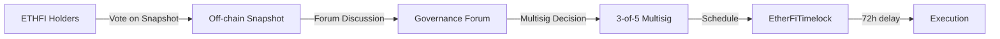
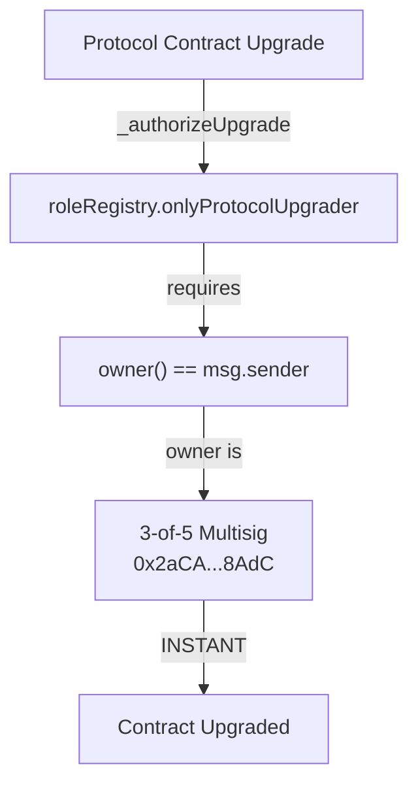
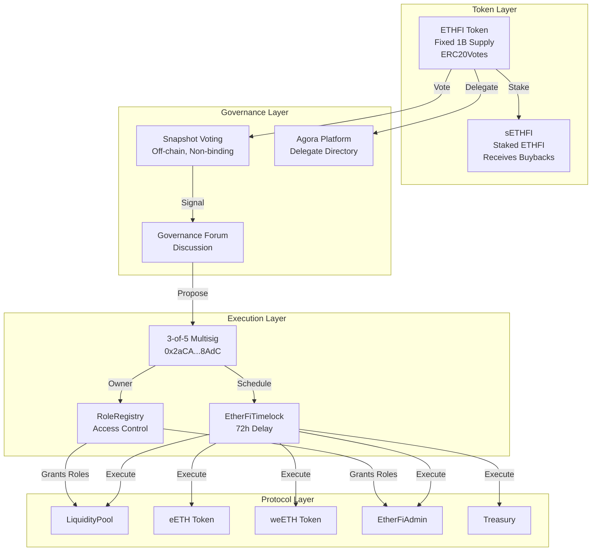

# ETHFI Token Research Report

## Aragon Ownership Token Framework Analysis

**Target:** ETHFI (Ether.fi Governance Token)
**Token Address:** [`0xFe0c30065B384F05761f15d0CC899D4F9F9Cc0eB`](https://etherscan.io/address/0xFe0c30065B384F05761f15d0CC899D4F9F9Cc0eB) (Ethereum Mainnet)
**Date:** 2026-02-19
**Researcher:** AI Agent (Aragon Framework)

---

## Executive Summary

ETHFI is a governance token for the ether.fi liquid staking protocol. The token implements ERC20Votes for on-chain voting capability, but **governance is currently in a transitional phase** with votes occurring off-chain via Snapshot, executed by a team-controlled multisig.

**Critical Finding:** While protocol contracts are nominally "owned" by a Timelock, **contract upgrades bypass the timelock entirely**. The `_authorizeUpgrade()` function checks `roleRegistry.onlyProtocolUpgrader(msg.sender)`, which requires `msg.sender == roleRegistry.owner()` — the 3-of-5 multisig directly. The multisig can upgrade contracts instantly without any delay.

**Key Findings:**
- **Supply:** Fixed at 1B with ~998.5M currently circulating (some burned). No mint function exists.
- **Governance:** Off-chain Snapshot voting → multisig execution. Not on-chain binding.
- **Upgrade Authority:** 3-of-5 multisig can upgrade contracts **immediately** (no timelock protection)
- **Value Accrual:** Active buyback program distributing to sETHFI stakers, but Foundation-discretionary
- **Token Rights:** No censorship, no pause, no blacklist in ETHFI token contract

---

## 1. On-Chain Control

### 1.1 Onchain Governance Workflow

**Status:** ⚠️ PARTIAL

**Finding:** ETHFI implements ERC20Votes enabling delegation and voting power tracking. However, the protocol does **not** currently have a deployed on-chain Governor contract that binds token votes to protocol execution.

**Current Flow:**


**Evidence:**
- Agora governance page states Phase 1 includes: "launching offchain voting on Snapshot, delegate elections, our security council, and discourse groups"
  - Source: [Agora Governance Info](https://vote.ether.fi/info)
- Agora platform (vote.ether.fi) is a delegate directory, not binding on-chain voting
- 4-day voting window with 1M ETHFI quorum required
  - Source: [Governance Forum](https://governance.ether.fi/)

**Verification:**
- No Governor contract address found in deployed contracts documentation
- EtherFiTimelock at `0x9f26d4C958fD811A1F59B01B86Be7dFFc9d20761` has 72-hour min delay
  ```
  cast call: getMinDelay() = 259200 (72 hours)
  ```

**Implication:** ETHFI tokenholders can signal preference but cannot unilaterally force execution. The multisig committee can theoretically ignore Snapshot results.

---

### 1.2 Role Accountability

**Status:** ⚠️ PARTIAL

**Finding:** Protocol roles are managed via RoleRegistry, which is owned by a 3-of-5 multisig. Tokenholders do not elect or control the multisig signers.

**RoleRegistry Analysis:**
- Contract: [`0x1d3Af47C1607A2EF33033693A9989D1d1013BB50`](https://etherscan.io/address/0x1d3Af47C1607A2EF33033693A9989D1d1013BB50)
- Owner: [`0x2aCA71020De61bb532008049e1Bd41E451AE8AdC`](https://etherscan.io/address/0x2aCA71020De61bb532008049e1Bd41E451AE8AdC) (3-of-5 Safe)

**On-chain verification:**
```
RoleRegistry.owner() = 0x2aCA71020De61bb532008049e1Bd41E451AE8AdC
Safe.getThreshold() = 3
Safe.getOwners() = [
  0x566e58ac0f2c4bcaf6de63760c56cc3f825c48f5,
  0x71b67ac997056c9935f8aa98f3344432ea2ec15c,
  0x5dfb8bc4830ccf60d469d546aec36531c97b96b5,
  0x0fa238cb37e58556b23ea45643ffe4da382162a53,
  0x46cba1e9b1e5db32da28428f2fb85587bcb785e7
]
```

**Defined Roles (RoleRegistry.sol lines 13-14):**
```solidity
bytes32 public constant PROTOCOL_PAUSER = keccak256("PROTOCOL_PAUSER");
bytes32 public constant PROTOCOL_UNPAUSER = keccak256("PROTOCOL_UNPAUSER");
```
- Source: [RoleRegistry.sol:13-14](https://github.com/etherfi-protocol/smart-contracts/blob/master/src/RoleRegistry.sol#L13-L14)

**Upgrade Authority (RoleRegistry.sol line 76-78):**
```solidity
function onlyProtocolUpgrader(address account) public view {
    if (owner() != account) revert OnlyProtocolUpgrader();
}
```
- Source: [RoleRegistry.sol:76-78](https://github.com/etherfi-protocol/smart-contracts/blob/master/src/RoleRegistry.sol#L76-L78)

**Implication:** The 3-of-5 multisig has ultimate control over:
- Who can pause/unpause protocol
- Who can upgrade protocol contracts
- Role assignments for all protocol functions

---

### 1.3 Protocol Upgrade Authority

**Status:** ❌ MULTISIG-CONTROLLED (NO TIMELOCK PROTECTION)

**Critical Finding:** While protocol contracts have `owner()` set to EtherFiTimelock, **contract upgrades bypass the timelock entirely**. Upgrades are authorized via `RoleRegistry.onlyProtocolUpgrader()` which checks if `msg.sender == roleRegistry.owner()` — the 3-of-5 multisig directly.

**Upgrade Authorization Path:**


**Code Evidence (RoleRegistry.sol line 76-78):**
```solidity
function onlyProtocolUpgrader(address account) public view {
    if (owner() != account) revert OnlyProtocolUpgrader();
}
```
- Source: [RoleRegistry.sol:76-78](https://github.com/etherfi-protocol/smart-contracts/blob/master/src/RoleRegistry.sol#L76-L78)

**Upgrade Path (LiquidityPool.sol line 529-531):**
```solidity
function _authorizeUpgrade(address newImplementation) internal override {
    roleRegistry.onlyProtocolUpgrader(msg.sender);
}
```
- Source: [LiquidityPool.sol:529-531](https://github.com/etherfi-protocol/smart-contracts/blob/master/src/LiquidityPool.sol#L529-L531)

**On-chain Verification:**
```
RoleRegistry.owner() = 0x2aCA71020De61bb532008049e1Bd41E451AE8AdC (3-of-5 Multisig)
```

**Implication:** The 3-of-5 multisig can upgrade all UUPS proxy contracts (LiquidityPool, eETH, weETH, EtherFiAdmin, etc.) **immediately** without any timelock delay. This is a significant centralization risk.

**Contract Ownership vs Upgrade Authority:**
| Contract | owner() | Upgrade Authority |
|----------|---------|-------------------|
| LiquidityPool | Timelock | **Multisig (direct)** |
| eETH | Timelock | **Multisig (direct)** |
| weETH | Timelock | **Multisig (direct)** |
| EtherFiAdmin | Timelock | **Multisig (direct)** |
| RoleRegistry | Multisig | **Multisig (direct)** |

Note: `owner()` controls non-upgrade admin functions. Upgrades are controlled separately via `roleRegistry.onlyProtocolUpgrader()`.

**Timelock Existence:**
- A timelock contract exists at `0x9f26d4C958fD811A1F59B01B86Be7dFFc9d20761` with 72-hour delay
- The timelock is the `owner()` of protocol contracts for non-upgrade functions
- **However, upgrades do NOT go through the timelock**

**Timelock PROPOSER_ROLE:** [UNVERIFIED]
- Aragon was unable to verify which address holds PROPOSER_ROLE on the Timelock via on-chain queries
- `hasRole(PROPOSER_ROLE, multisig)` returned `false` for both known multisigs
- The Timelock's role assignments may be found via event logs or deployment transaction analysis

---

### 1.4 Token Upgrade Authority

**Status:** ✅ NOT UPGRADEABLE

**Finding:** The ETHFI token on Ethereum mainnet is a standard ERC-20 (non-proxy). It cannot be upgraded.

**Evidence:**
- Contract bytecode begins with `0x608060405234801561001057...` (standard contract, not proxy)
- No EIP-1967 implementation slot found
- Contract source shows standard OpenZeppelin ERC20 inheritance

**Token Implementation:**
```solidity
contract EtherFiGovernanceToken is ERC20, ERC20Burnable, ERC20Permit, ERC20Votes {
    constructor()
        ERC20("ether.fi governance token", "ETHFI")
        ERC20Permit("ether.fi governance token")
    {
        _mint(0x7A6A41F353B3002751d94118aA7f4935dA39bB53, 1000000000 * 10 ** decimals());
    }
}
```
- Source: [Etherscan Verified Source](https://etherscan.io/address/0xFe0c30065B384F05761f15d0CC899D4F9F9Cc0eB#code)

---

### 1.5 Supply Control

**Status:** ✅ FIXED SUPPLY

**Finding:** ETHFI has a fixed supply of 1 billion tokens. No mint function exists in the contract. Supply can only decrease through burning.

**On-chain Verification:**
```
totalSupply() = 998,535,999 ETHFI (approximately 1.46M burned)
```

**Contract Analysis:**
- Inherits `ERC20Burnable` - allows holders to burn their own tokens
- No `mint()` function in contract
- All 1B minted at deployment to: `0x7A6A41F353B3002751d94118aA7f4935dA39bB53`

**Documentation Confirmation:**
> "ETHFI has a fixed supply of 1B, with no further issuance."
- Source: [ETHFI Allocations](https://etherfi.gitbook.io/gov/ethfi-allocations)

---

### 1.6 Privileged Access Gating

**Status:** ⚠️ PAUSE EXISTS (Protocol, not Token)

**Finding:** Protocol contracts (LiquidityPool, eETH operations) can be paused by addresses holding PROTOCOL_PAUSER role. The ETHFI token itself has no pause function.

**Pause Authority (EtherFiAdmin.sol lines 102-127):**
```solidity
function pause(...) external {
    if( !roleRegistry.hasRole(roleRegistry.PROTOCOL_PAUSER(), msg.sender)) revert IncorrectRole();
    // Can pause: etherFiOracle, stakingManager, auctionManager,
    //           etherFiNodesManager, liquidityPool, membershipManager
}
```
- Source: [EtherFiAdmin.sol:102-127](https://github.com/etherfi-protocol/smart-contracts/blob/master/src/EtherFiAdmin.sol#L102-L127)

**Unpause Authority (EtherFiAdmin.sol lines 129-154):**
- Requires PROTOCOL_UNPAUSER role

**Impact:** While the protocol (staking/unstaking operations) can be paused, ETHFI token transfers remain unaffected. eETH holders could be temporarily blocked from withdrawing to ETH if LiquidityPool is paused.

---

### 1.7 Token Censorship

**Status:** ✅ NO CENSORSHIP

**Finding:** The ETHFI token contract contains no blacklist, freeze, seizure, or transfer restriction mechanisms.

**Contract Analysis:**
- Standard ERC-20 transfer with no hooks or restrictions
- No `blacklist` or `freeze` mapping
- No admin override for transfers
- Inherits only: ERC20, ERC20Burnable, ERC20Permit, ERC20Votes

**eETH Analysis (EETH.sol):**
- No blacklist functions
- No pause on transfers
- Standard transfer logic at [EETH.sol:168-172](https://github.com/etherfi-protocol/smart-contracts/blob/master/src/EETH.sol#L168-L172)

---

## 2. Value Accrual

### 2.1 Accrual Active

**Status:** ✅ ACTIVE (with caveats)

**Finding:** An ETHFI buyback program is operational, distributing purchased tokens to sETHFI stakers. However, execution is Foundation-discretionary rather than programmatic.

**Buyback Sources:**
1. **Weekly:** 100% of eETH withdrawal fees
2. **Monthly:** Portion of broader protocol revenue (Stake, Liquid, Cash products)

**Distribution:**
- All buyback proceeds → sETHFI stakers
- Staking at: [ether.fi/app/ethfi](https://www.ether.fi/app/ethfi)

**On-chain Evidence:**
- Foundation Wallet: `0x2f5301a3D59388c509C65f8698f521377D41Fd0F`
- Current ETHFI Balance: ~2.58M ETHFI (held for distribution)
- sETHFI Contract: `0x86B5780b606940Eb59A062aA85a07959518c0161`
- sETHFI Total Supply: ~75.6M tokens

**Caveat:** Buyback execution and distribution are announced via Foundation Twitter, not enforced by smart contract. The Foundation has discretion over timing and amounts.

- Source: [ETHFI Buyback Program](https://etherfi.gitbook.io/gov/ethfi-buyback-program)

---

### 2.2 Treasury Ownership

**Status:** ⚠️ TIMELOCK-CONTROLLED (not tokenholder-controlled)

**Finding:** The protocol Treasury is owned by EtherFiTimelock. However, timelock proposers are the multisig committee, not tokenholders.

**Treasury Contract:**
- Address: [`0x6329004E903B7F420245E7aF3f355186f2432466`](https://etherscan.io/address/0x6329004E903B7F420245E7aF3f355186f2432466)
- Owner: `0x9f26d4C958fD811A1F59B01B86Be7dFFc9d20761` (Timelock)

**Current Holdings:** [UNVERIFIED - Treasury contract shows 0 ETHFI and 0 eETH on-chain. Actual treasury holdings may be in other wallets.]

---

### 2.3 Accrual Mechanism Control

**Status:** ⚠️ FOUNDATION-CONTROLLED

**Finding:** Protocol fee parameters and buyback allocation are not enforced on-chain. The fee split (90/5/5 staker/treasury/node operator) is documented but can be changed by protocol admin.

**Fee Configuration (LiquidityPool.sol):**
- feeRecipient set by LIQUIDITY_POOL_ADMIN_ROLE
- Source: [LiquidityPool.sol:434-439](https://github.com/etherfi-protocol/smart-contracts/blob/master/src/LiquidityPool.sol#L434-L439)

**Buyback Parameters:**
- Percentage allocation: Documentation states 100% of withdrawal fees
- No on-chain enforcement of this commitment

---

### 2.4 Offchain Value Accrual

**Status:** ❌ NONE IDENTIFIED

**Finding:** No legally binding revenue sharing arrangements or licensing revenue documented.

---

## 3. Verifiability

### 3.1 Token Contract Source Verification

**Status:** ✅ VERIFIED

**Finding:** ETHFI token contract is verified on Etherscan with full source code.

**Evidence:**
- [Etherscan Verified Source](https://etherscan.io/address/0xFe0c30065B384F05761f15d0CC899D4F9F9Cc0eB#code)
- Compiler: Solidity 0.8.20
- License: MIT

---

### 3.2 Protocol Component Source Verification

**Status:** ✅ VERIFIED

**Finding:** All core protocol contracts are verified on Etherscan and match the public GitHub repository.

**Repository:** [etherfi-protocol/smart-contracts](https://github.com/etherfi-protocol/smart-contracts)
**License:** MIT (declared in README, SPDX headers in contracts)

**Audit Coverage:**
- Multiple audits available at [audits folder](https://github.com/etherfi-protocol/smart-contracts/tree/master/audits)
- Formal verification via Certora

---

## 4. Token Distribution

### 4.1 Ownership Concentration

**Status:** ⚠️ CONCENTRATED (Vesting Mitigates)

**Finding:** Over 55% of tokens allocated to Investors and Core Contributors, though subject to vesting.

**Allocation Breakdown:**
| Category | Percentage | Vesting | Cliff |
|----------|-----------|---------|-------|
| Investors | 33.74% | 2 years | 1 year |
| Treasury | 21.62% | None | - |
| Core Contributors | 21.47% | 3 years | 1 year |
| User Airdrops | 19.27% | Various | - |
| Partnerships | 3.9% | - | - |

**Current Circulating:** ~699M ETHFI (69.9% of total supply)
**Fully Diluted:** 1B ETHFI

- Source: [ETHFI Allocations](https://etherfi.gitbook.io/gov/ethfi-allocations)

---

### 4.2 Future Token Unlocks

**Status:** ⚠️ ONGOING UNLOCKS

**Finding:** Continuous daily unlocks from team and investor allocations.

**Unlock Status (approximate):**
- Team: 77.96M unlocked of 232.6M (33.5%)
- Investors: 217.55M unlocked of 325M (67%)
- Daily unlock rate: ~1.2M ETHFI/day

**Full vesting completion:** By end of 2030

- Source: [DefiLlama Unlocks](https://defillama.com/unlocks/ether.fi), [CryptoRank Vesting](https://cryptorank.io/price/ether-fi/vesting)

---

## 5. Offchain Dependencies

### 5.1 Trademark

**Status:** ⚠️ COMPANY-CONTROLLED

**Finding:** Trademarks are owned by Ether.Fi SEZC (Cayman Islands company), not a tokenholder-controlled entity.

**Evidence:**
> "The Company name, the terms, the Company logo, and all related names, logos, product and service names, designs, and slogans are trademarks of the Company or its affiliates or licensors."
- Source: [Terms of Use](https://etherfi.gitbook.io/etherfi/ether.fi-legal/terms-of-use)

---

### 5.2 Distribution

**Status:** ⚠️ COMPANY-CONTROLLED

**Finding:** The ether.fi domain and platform are operated by Ether.Fi SEZC, a Cayman Islands Special Economic Zone Company.

**Legal Entity:** Ether.Fi SEZC
**Jurisdiction:** Cayman Islands
**Relationship to DAO:** None documented. The company operates with "unilateral control over terms and services."

---

### 5.3 Licensing

**Status:** ✅ OPEN SOURCE

**Finding:** Protocol smart contracts are MIT licensed, allowing unrestricted use, modification, and distribution.

**Evidence:**
- README states: "ether.fi is open-source and licensed under the MIT License"
- SPDX-License-Identifier: MIT in contract headers
- Source: [GitHub Repository](https://github.com/etherfi-protocol/smart-contracts)

---

## Governance Flow Diagram



---

## Control Summary

| Component | Controller | Tokenholder Control |
|-----------|------------|---------------------|
| ETHFI Supply | Immutable | ✅ Cannot be changed |
| ETHFI Transfers | Permissionless | ✅ No restrictions |
| Protocol Upgrades | 3-of-5 Multisig (INSTANT, no timelock) | ❌ Multisig controlled |
| Role Assignments | 3-of-5 Multisig | ❌ Multisig controlled |
| Treasury | Timelock ← [PROPOSER UNVERIFIED] | ❌ Multisig controlled |
| Pause Functions | PROTOCOL_PAUSER role | ⚠️ Role assigned by multisig |
| Buybacks | Foundation discretionary | ❌ Not on-chain enforced |
| Trademarks | Ether.Fi SEZC | ❌ Company controlled |

---

## Conflicts of Interest

### Identified Risks

1. **Governance Bypass Risk:** Team/Foundation multisig can propose and execute changes without binding tokenholder approval. Snapshot votes are advisory.

2. **Insider Concentration:** 55% allocated to investors + team (vesting mitigates but doesn't eliminate)

3. **Value Accrual Discretion:** Buyback execution is Foundation-discretionary, not programmatic. Foundation could theoretically reduce or pause buybacks.

4. **Legal Entity Disconnect:** Ether.Fi SEZC (Cayman company) owns trademarks and operates platform. No documented legal obligation to tokenholders.

5. **Upgrade Authority:** 3-of-5 multisig can upgrade contracts **immediately** with no timelock delay. This is a significant centralization risk.

---

## Comparison to Roadmap Claims

| Claimed | Reality |
|---------|---------|
| "Decentralized governance" | Off-chain voting, multisig execution |
| "Community controls treasury" | Timelock controlled, multisig proposes |
| "Tokenholders govern protocol" | Advisory votes only, no binding on-chain |
| "Progressive decentralization" | Currently in Phase 1, full decentralization TBD |

---

## Conclusion

ETHFI token provides:
- ✅ Fixed supply with no inflation risk
- ✅ Transfer freedom with no censorship capability
- ✅ Active value accrual through buyback program
- ✅ Verified, audited, open-source protocol

ETHFI token lacks:
- ❌ Binding on-chain governance
- ❌ Tokenholder control over protocol upgrades (multisig can upgrade instantly)
- ❌ Timelock protection for contract upgrades
- ❌ Programmatic (non-discretionary) value distribution
- ❌ Tokenholder-controlled legal entity

**Framework Assessment:** ETHFI is a governance token with potential future utility but currently limited enforceable rights. Tokenholders can participate in advisory voting and receive buyback distributions through staking, but ultimate control over the protocol remains with the Foundation/Team multisig.

---

## Contract Reference Table

| Contract | Address | Owner/Admin |
|----------|---------|-------------|
| ETHFI Token | `0xFe0c30065B384F05761f15d0CC899D4F9F9Cc0eB` | Immutable |
| sETHFI | `0x86B5780b606940Eb59A062aA85a07959518c0161` | [UNVERIFIED] |
| EtherFiTimelock | `0x9f26d4C958fD811A1F59B01B86Be7dFFc9d20761` | - |
| RoleRegistry | `0x1d3Af47C1607A2EF33033693A9989D1d1013BB50` | 3-of-5 Multisig |
| LiquidityPool | `0x308861A430be4cce5502d0A12724771Fc6DaF216` | Timelock |
| eETH | `0x35fA164735182de50811E8e2E824cFb9B6118ac2` | Timelock |
| weETH | `0xCd5fE23C85820F7B72D0926FC9b05b43E359b7ee` | Timelock |
| EtherFiAdmin | `0x0EF8fa4760Db8f5Cd4d993f3e3416f30f942D705` | Timelock |
| Treasury | `0x6329004E903B7F420245E7aF3f355186f2432466` | Timelock |
| Protocol Multisig | `0x2aCA71020De61bb532008049e1Bd41E451AE8AdC` | 3-of-5 Safe |
| Foundation Wallet | `0x2f5301a3D59388c509C65f8698f521377D41Fd0F` | [UNVERIFIED] |

---

## Sources

### Primary Sources
- [etherfi-protocol/smart-contracts GitHub](https://github.com/etherfi-protocol/smart-contracts)
- [Etherscan ETHFI Token](https://etherscan.io/address/0xFe0c30065B384F05761f15d0CC899D4F9F9Cc0eB)
- [Ether.fi Protocol Documentation](https://etherfi.gitbook.io/etherfi/)
- [Ether.fi Governance Documentation](https://etherfi.gitbook.io/gov/)

### Governance
- [Agora Voting Platform](https://vote.ether.fi/)
- [Governance Forum](https://governance.ether.fi/)
- [Governance Roadmap](https://etherfi.gitbook.io/gov/governance-roadmap)

### Risk Assessments
- [Prisma Risk weETH Assessment](https://hackmd.io/@PrismaRisk/weETH)

### On-chain Verification
- RPC: `https://eth.llamarpc.com`
- All contract calls verified February 2026
